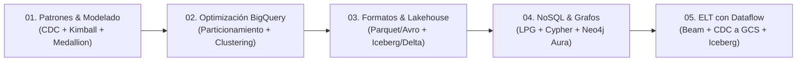

# Arquitecturas y Patrones Analíticos en Google Cloud

Repositorio de referencia técnica y codelabs prácticos sobre **diseño de arquitecturas de datos, modelado analítico, formatos de almacenamiento y optimización en Google Cloud Platform (GCP)**.

Cada módulo combina **fundamentos arquitectónicos de nivel enterprise** (guías teóricas con diagramas y matrices de decisión) y **laboratorios prácticos autónomos** diseñados para ejecutarse paso a paso midiendo costos, latencias y rendimiento real.

---

## 📚 Mapa de Contenidos

| Módulo | Componentes | Tema Central | Stack Tecnológico | Qué Aprendes y Construyes |
|---|---|---|---|---|
| **[01. Patrones y Modelado](01-patrones-y-modelado/)** | 📖 [Teoría](01-patrones-y-modelado/teoria.md)<br>🛠️ [Laboratorio](01-patrones-y-modelado/lab.md) | Ingesta heterogénea, CDC, Arquitectura Medallion y Modelado Dimensional (Kimball) | Cloud SQL (PostgreSQL), Firestore, Datastream, BigQuery, Dataform, Looker Studio | **Teoría:** Inmon vs. Kimball, ETL vs. ELT vs. Virtualización, SCD Tipo 2 y Capa Semántica (Metric Layer).<br>**Lab:** Pipeline CDC en tiempo real hacia BigQuery y pipeline Dataform Bronze → Silver → Gold con data marts. |
| **[02. Optimización en BigQuery](02-optimizacion-bigquery/)** | 📖 [Teoría](02-optimizacion-bigquery/teoria.md)<br>🛠️ [Laboratorio](02-optimizacion-bigquery/lab.md) | Particionamiento, clustering, podado de particiones y tuning de SQL | BigQuery, BigQuery Studio, Google Cloud Shell, NYC Taxi Public Data | **Teoría:** Arquitectura Dremel, Capacitor y Colossus, Shuffle distribuido, métricas de Slots, Data Skew y antipatrones SQL.<br>**Lab:** Creación de tres variantes físicas de una misma tabla (plana, particionada, particionada + clusterizada) con datos públicos de NYC Taxi. Comparativa empírica de bytes escaneados, costo y slot time. |
| **[03. Formatos y Lakehouse](03-formatos-y-lakehouse/)** | 📖 [Teoría](03-formatos-y-lakehouse/teoria.md)<br>🛠️ [Laboratorio](03-formatos-y-lakehouse/lab.md) | Serialización binaria en disco y formatos de tabla abiertos (Open Table Formats) | BigQuery, Cloud Storage, BigLake, Apache Iceberg, Delta Lake, Apache Hudi | **Teoría:** Avro (fila) vs. Parquet/ORC (columnar); logs transaccionales ACID y metadata trees en Iceberg, Delta y Hudi.<br>**Lab:** Exportación e inspección binaria CSV vs. Avro vs. Parquet, creación y mutación DML de tablas Iceberg gestionadas en BigQuery, y lectura de Delta con `delta-rs`. |
| **[04. NoSQL y Grafos con Neo4j](04-nosql-grafos-neo4j/)** | 📖 [Teoría](04-nosql-grafos-neo4j/teoria.md)<br>🛠️ [Laboratorio](04-nosql-grafos-neo4j/lab.md) | Panorama NoSQL, modelo Labeled Property Graph (LPG), Index-Free Adjacency y Cypher | Neo4j AuraDB (Free Tier), Neo4j Workspace / Browser, Cypher Query Language | **Teoría:** Familias NoSQL, CAP/PACELC, modelo LPG vs RDF, Index-Free Adjacency vs JOIN explosion, GraphRAG y matriz de decisión.<br>**Lab:** Provisión en la nube con Neo4j AuraDB Free ($0), modelado e ingesta GraphCommerce con `MERGE`, comparativa empírica SQL vs Cypher, recomendaciones colaborativas, caminos mínimos (`shortestPath`) y detección de anillos de fraude. |
| **[05. ELT con Dataflow e Iceberg](05-elt-dataflow-iceberg/)** | 📖 [Teoría](05-elt-dataflow-iceberg/teoria.md)<br>🛠️ [Laboratorio](05-elt-dataflow-iceberg/lab.md) | ELT programático con Apache Beam, CDC vía Datastream hacia Cloud Storage y Bronze/Silver Iceberg | Cloud SQL (PostgreSQL), Datastream, Cloud Storage, Apache Beam / Dataflow, BigQuery (tablas Iceberg gestionadas + datamart nativo), Looker Studio | **Teoría:** Modelo de programación de Beam (PCollection, ParDo, GroupByKey), Dataflow como servicio gestionado, CDC de Datastream como archivos Avro anidados, por qué escribir Iceberg vía BigQuery en vez del conector nativo `IcebergIO`.<br>**Lab (taller de 2h):** Stream de Datastream Cloud SQL→GCS, tres jobs de Dataflow (Bronze → Silver con deduplicación de CDC → Gold) que terminan en un datamart `fact_sales`/`dim_customer`/`dim_product` en BigQuery. |

---

## 🗂️ Estructura del Repositorio

```text
analytics-architectures-labs/
├── README.md                          ← Índice general y guía de navegación
│
├── 01-patrones-y-modelado/
│   ├── teoria.md                      ← Marco conceptual: CDC, Inmon vs Kimball, Medallion, SCD2, Metric Layer
│   └── lab.md                         ← Codelab: Pipeline CDC con Datastream + Dataform en BigQuery
│
├── 02-optimizacion-bigquery/
│   ├── teoria.md                      ← Marco conceptual: Dremel, Capacitor, Slots, Shuffle, Particionamiento, FinOps
│   └── lab.md                         ← Codelab: Particionamiento, Clustering y optimización de SQL
│
├── 03-formatos-y-lakehouse/
│   ├── teoria.md                      ← Marco conceptual: Avro, Parquet, ORC, Apache Iceberg, Delta Lake, Hudi
│   └── lab.md                         ← Codelab: Formatos de archivo y tablas abiertas con BigQuery y BigLake
│
├── 04-nosql-grafos-neo4j/
│   ├── teoria.md                      ← Marco conceptual: NoSQL, LPG, Index-Free Adjacency, Cypher, GraphRAG
│   └── lab.md                         ← Codelab: Neo4j AuraDB Free, Cypher vs SQL, recomendaciones y fraude
│
└── 05-elt-dataflow-iceberg/
    ├── teoria.md                      ← Marco conceptual: modelo de programación Beam, Datastream a GCS, Iceberg vía BigQuery
    └── lab.md                         ← Codelab (taller 2h): Datastream CDC + Dataflow Bronze/Silver/Gold + datamart BigQuery
```

---

## 🎯 Ruta de Aprendizaje Recomendada



1. **Módulo 01:** Comienza entendiendo los paradigmas de ingesta e integración moderna (ELT, CDC) y cómo estructurar el almacenamiento en capas Medallion organizando un bus dimensional con Dataform.
2. **Módulo 02:** Profundiza en el motor analítico de BigQuery, aprendiendo a controlar costos de consulta mediante diseño físico (particiones/clusters) y buenas prácticas SQL.
3. **Módulo 03:** Comprende las bases del Data Lakehouse abierto: cómo se serializan los datos en disco y cómo los formatos de tabla abiertos desacoplan el almacenamiento del cómputo evitando el *vendor lock-in*.
4. **Módulo 04:** Descubre el paradigma NoSQL orientado a grafos, comprendiendo la arquitectura de *Index-Free Adjacency* para resolver consultas hiperconectadas sin la explosión de `JOIN`s de los modelos relacionales.
5. **Módulo 05:** Cierra el círculo combinando los tres módulos anteriores: usa Datastream (Módulo 01) para entregar CDC como archivos a un lago de datos, Apache Beam/Dataflow como motor programático de transformación cuando el SQL declarativo no basta, y tablas Iceberg gestionadas en BigQuery (Módulo 03) como el lakehouse abierto donde aterrizan Bronze y Silver antes del datamart Gold.

---

## 🚀 Prerrequisitos Generales

- **Cuenta de Google Cloud** con facturación habilitada y un proyecto activo (para Módulos 01, 02, 03 y 05).
- **Google Cloud SDK (`gcloud`)** instalado y autenticado:
  ```bash
  gcloud auth login
  gcloud config set project TU_PROYECTO
  ```
  *(o alternativamente acceso a **Cloud Shell** en la consola de GCP).*
- **Cuenta en Neo4j Aura** (para el Módulo 04): Gratuita, sin tarjeta de crédito, ejecutable 100% desde el navegador web.
- Permisos IAM requeridos (en GCP): roles de edición/administración sobre BigQuery, Cloud Storage, y en el caso de los Módulos 01 y 05, Cloud SQL, Datastream y (Módulo 05) Dataflow.
- Conocimientos intermedios de **SQL** y fundamentos de bases de datos relacionales y NoSQL.

---

## 💡 Metodología de Uso de los Labs

1. **Lee la teoría:** Antes de ejecutar los labs que incluyan `teoria.md`, dale un vistazo para entender el *porqué* arquitectónico de cada decisión de diseño.
2. **Abre el codelab (`lab.md`):** Revisa objetivos, prerrequisitos específicos y estimación de costos al inicio del documento.
3. **Configura tus variables:** Reemplaza los marcadores de posición tipo `TU_PROYECTO` o `TU_BUCKET` con tus identificadores reales.
4. **Ejecuta en orden:**
   - Bloques ```sql```: En el editor de consultas de BigQuery Studio (o Dataform).
   - Bloques ```cypher```: En el editor de consultas de Neo4j Workspace / Browser.
   - Bloques ```bash```: En Cloud Shell o tu terminal local configurada.
5. **Compara y valida:** Observa las métricas reales de ejecución (bytes escaneados, slots consumidos, planes de ejecución, visualización de grafos).
6. **🧹 Paso de Limpieza (Cleanup):** Al finalizar cada lab, ejecuta siempre la sección de limpieza para evitar costos residuales por recursos encendidos.

---

## 💰 Gestión de Costos y Capa Gratuita (FinOps)

Los laboratorios están diseñados para aprovechar al máximo el **GCP Free Tier** y las capas gratuitas en la nube:

| Servicio | Nivel Gratuito / Estimación | Consideración |
|---|---|---|
| **BigQuery Consultas (On-demand)** | Primer 1 TiB/mes gratis | Las consultas del Módulo 02 y 03 consumen fracciones menores a 2–3 GB si aplicas las particiones indicadas. |
| **BigQuery Almacenamiento** | Primeros 10 GiB/mes gratis | Las tablas creadas en los laboratorios caben holgadamente dentro del límite gratuito. |
| **Cloud Storage** | Primeros 5 GiB/mes gratis | Usado en Módulo 03 para archivos binarios y metadatos Iceberg. |
| **Neo4j AuraDB Free (Módulo 04)** | 1 instancia perpetua gratis | Hasta 200k nodos y 400k relaciones, 0 costo, sin requerir tarjeta de crédito. |
| **Cloud SQL / Datastream (Módulos 01 y 05)** | Usan instancias mínimas (`db-f1-micro`) | ⚠️ **No son gratuitos mientras estén en ejecución.** Es indispensable apagarlos o eliminarlos al terminar la sesión. |
| **Dataflow (Módulo 05)** | 3 jobs batch cortos (~10-15 min cada uno) | ⚠️ **No es gratuito.** Cada job aprovisiona y libera sus propios workers; el costo es bajo para este volumen pero no es $0. |
| **Cargas hacia tablas Iceberg gestionadas (Módulo 05)** | `LOAD JOB`/mantenimiento en `bronze`/`silver` | ⚠️ **No cubierto por la capa gratuita de BigQuery.** Se factura con slots Enterprise pay-as-you-go, a diferencia de las cargas a tablas nativas. |

---

## 🌐 Convenciones y Regiones

- **Regiones:**
  - **Módulo 01:** Utiliza la región `us-central1`.
  - **Módulos 02 y 03:** Utilizan la multi-región `US` (necesaria para consumir directamente los datasets de `bigquery-public-data`).
  - **Módulo 04:** Utiliza la región cloud de tu preferencia en Neo4j Aura (GCP o AWS).
  - **Módulo 05:** Utiliza la región `us-central1` para Cloud SQL, Datastream, Dataflow y los datasets de BigQuery (deben coincidir para minimizar latencia y evitar cargos de transferencia entre regiones).
- **Seguridad:** Los nombres de usuario, contraseñas e IPs en los laboratorios son estrictamente ilustrativos; nunca uses credenciales reales en texto plano ni abras firewalls a `0.0.0.0/0` fuera de entornos de laboratorio aislados.

---

## 🤝 Contribuir

Para proponer o agregar un nuevo módulo temático:

1. Crea la carpeta `0N-<nombre-del-modulo>/` con su `lab.md` y opcionalmente `teoria.md`.
2. Sigue la estructura estandarizada:
   `Objetivos → Prerrequisitos → Costos → Implementación Paso a Paso → Limpieza → Retos Opcionales → Referencias`.
3. Actualiza el índice y la tabla de contenidos de este `README.md`.
4. Asegúrate de verificar la reproducibilidad de los comandos e incluir instrucciones de *cleanup*.
